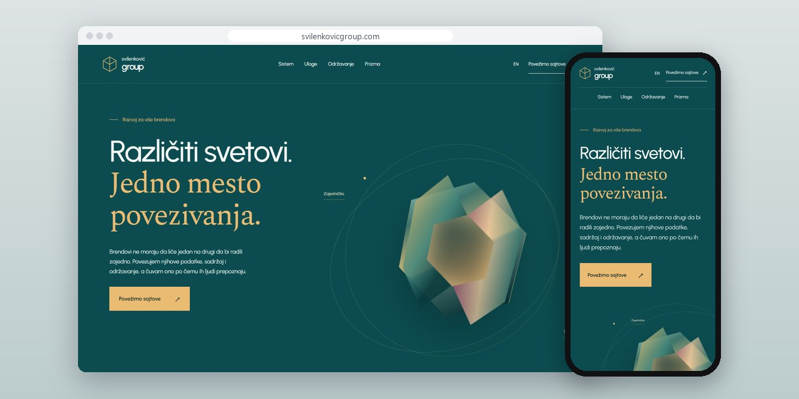
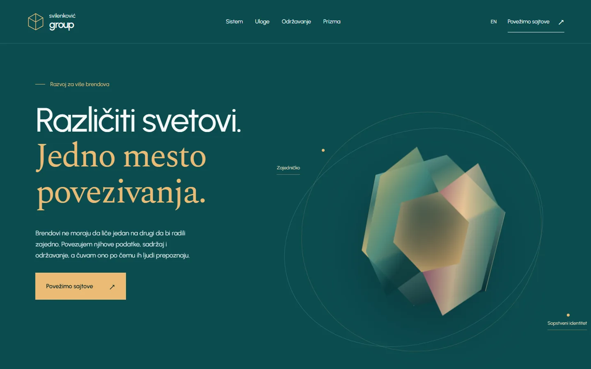
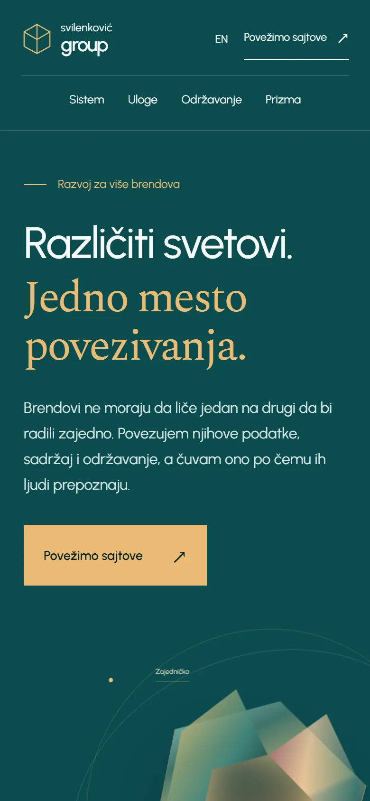
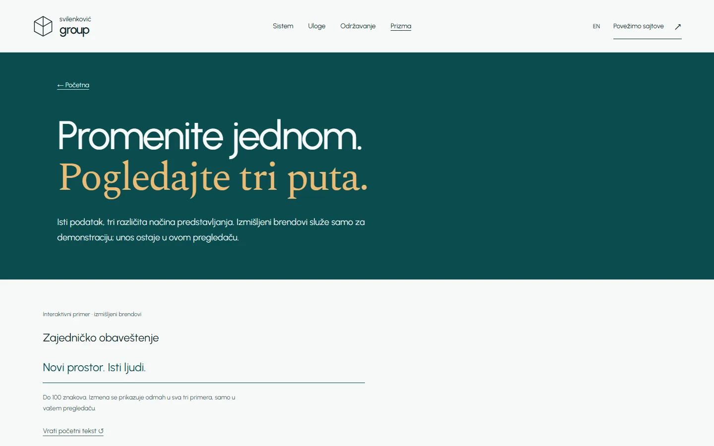

# Svilenković Group

A site about running several brands on shared data while each keeps its own voice, with an interactive prism as the example.

**[svilenkovicgroup.com](https://svilenkovicgroup.com/)** · [Case study (in Serbian)](https://svilenkovic.rs/radovi/svilenkovic-group) · [Srpski](README.sr.md)

> [!NOTE]
> My own project, not client work. The source code is private. This page describes what the site does and how it is built.

<table>
  <tr><td><b>Client</b></td><td>Own project</td></tr>
  <tr><td><b>Industry</b></td><td>Multi-brand web systems</td></tr>
  <tr><td><b>Location</b></td><td>Serbia</td></tr>
  <tr><td><b>Type</b></td><td>Multi-page website</td></tr>
  <tr><td><b>My role</b></td><td>Research, design, development, SEO and hosting</td></tr>
  <tr><td><b>Stack</b></td><td>Astro 7, TypeScript, GSAP, PHP 8.3, SQLite, nginx</td></tr>
</table>

## About the project

When a company runs several brands, the goal is not to make every site look the same. Data, roles and upkeep can be shared while each brand keeps its own tone and visual identity. Svilenković Group turns that difference into a model you can see.

On the home page one shape splits into several visual worlds as the visitor scrolls, a picture of a system that shares data without forcing one look. The Prism page lets you change one entry and see it shown for three brands; it is a demo with sample content, not a claim about real business databases. Separate pages cover who may edit what and how a change reaches several sites.

## What I built

- An interactive prism: one entry shown in three brands
- Pages on roles and publishing and on maintaining several sites
- A GSAP scroll scene, with all text and links available when motion is off
- Controls for pausing motion and keyboard access to every section
- Serbian and English versions of the whole site

## Results

| | Performance | Accessibility | Best practices | SEO |
| :-- | :-: | :-: | :-: | :-: |
| Mobile | 100 | 100 | 100 | 100 |
| Desktop | 100 | 100 | 100 | 100 |

PageSpeed Insights, lab test of the live site, October 2026. Security headers: 6 of 6. axe accessibility check: no violations. Structured data: `Organization`, `Person`.

## Screenshots

<table>
  <tr>
    <td width="68%" valign="top"></td>
    <td width="32%" valign="top"></td>
  </tr>
</table>

Interactive prism on the live site

---

Built by [D. Svilenković](https://svilenkovic.com).
